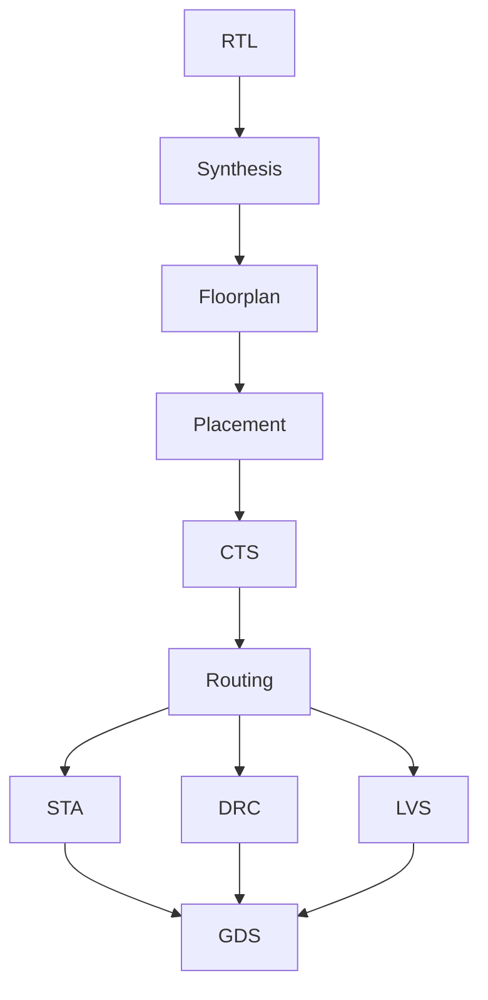

# RTL-to-GDS Accelerator

An RTL-to-GDS ASIC implementation study covering synthesis, floorplanning, placement, clock-tree synthesis, routing, static timing analysis, DRC/LVS sign-off methodology, congestion, and PPA analysis. The public source includes a reconstructed ARX permutation surrogate because the exact historical cryptographic RTL was lost.

| Item | Evidence status |
|---|---|
| Historical implementation | 16 nm FinFET cryptographic core |
| Surviving historical result | 228 MHz; DRC/LVS issues resolved |
| Historical raw RTL/reports | lost |
| Public reproduction RTL | 128-bit iterative ARX permutation surrogate |
| Public reproduction flow | OpenLane/OpenROAD-compatible configuration + SDC |
| Verification | Python reference model; RTL simulator hook can be added |

> The 228 MHz result belongs only to the lost original 16 nm implementation. It is not attributed to the public surrogate or open-source flow. See [`docs/provenance.md`](docs/provenance.md).

## 1. Overview

This repository restores the engineering methodology of the completed physical-design project without fabricating the missing proprietary/raw evidence. The public flow can be rerun from RTL to GDS on an open PDK, while the surviving 16 nm result is retained as qualified historical provenance.

## 2. Architecture

The current public surrogate is a 128-bit iterative add-rotate-XOR permutation. One round executes per cycle behind valid/ready handshaking, providing a compact but timing-relevant sequential datapath. See [`docs/architecture.md`](docs/architecture.md).

## 3. RTL

`rtl/arx_permutation_core.sv` is synthesizable SystemVerilog for the public reproduction path. It is explicitly not presented as recovered original cipher RTL.

## 4. Reference / Cycle Model

`model/python/arx_model.py` mirrors the round function and is covered by portable unit tests:

```bash
make test
```

## 5. ASIC Flow



See [`docs/flow.md`](docs/flow.md).

## 6. Synthesis

`synthesis/constraints/constraints.sdc` provides a documented current reconstruction constraint. New synthesis reports should record cell area, critical path, inferred resources, warnings, and unconstrained paths.

## 7. Floorplanning

The public configuration starts at moderate utilization/density and treats those values as experiment inputs. Historical die/core dimensions were not preserved and are not guessed.

## 8. Placement

Publish placement density, legalization status, timing, and congestion before/after any meaningful optimization.

## 9. Clock Tree

Record sink count, skew, insertion delay, buffers/inverters, and post-CTS setup/hold state from current reports.

## 10. Routing

Retain global/detail routing summaries, congestion evidence, antenna/repair status as applicable, and a compact layout image.

## 11. Timing Closure

The surviving historical result is **228 MHz** for the lost original 16 nm cryptographic implementation. No WNS/TNS/corner values are invented. New runs must include those details.

## 12. DRC / LVS

The surviving record confirms the original implementation's DRC/LVS issues were resolved. Exact violation counts/rules/fixes were lost. New public sign-off evidence belongs in `results/signoff/`.

## 13. PPA Analysis

Populate `results/ppa_template.csv` from report-derived data, then render it with:

```bash
python3 scripts/ppa_table.py results/ppa_template.csv
```

## 14. Architecture Tradeoffs

The public surrogate makes iteration count/unrolling and floorplan density explicit sweep dimensions. Do not translate these current experiments into claims about the historical cryptographic architecture.

## 15. Results

### Recovered sign-off evidence

| Preserved historical result | Value | Evidence record |
|---|---:|---|
| Technology class | 16 nm FinFET | [sign-off recovery](results/recovered_historical/signoff_recovery.rpt) |
| Achieved implementation frequency | 228 MHz | [sign-off recovery](results/recovered_historical/signoff_recovery.rpt) |
| Final DRC status | resolved | [sign-off recovery](results/recovered_historical/signoff_recovery.rpt) |
| Final LVS status | resolved | [sign-off recovery](results/recovered_historical/signoff_recovery.rpt) |

The raw commercial sign-off reports are not recoverable, so WNS/TNS/area/power fields remain blank in the [historical metrics table](results/recovered_historical/historical_signoff_metrics.csv) rather than being guessed. The current surrogate's [reference-model tests](results/regenerated_current/reference_model_test_summary.txt) are separately reproducible.

The current ARX reference-model suite passes **3/3 tests**. Physical-design metrics remain intentionally unpopulated until an actual OpenROAD/OpenLane or commercial flow is executed.


- [`results/timing/HISTORICAL_RESULT.md`](results/timing/HISTORICAL_RESULT.md): surviving 228 MHz result with evidence boundary.
- [`results/signoff/HISTORICAL_RESULT.md`](results/signoff/HISTORICAL_RESULT.md): surviving DRC/LVS-closure statement.
- `scripts/parse_results.py`: conservative report-to-JSON normalization that leaves unknown metrics null rather than guessing.

## 16. Debugging

New DRC/LVS/timing/congestion case studies must come from actual rerun failures. Historical rule names and root causes are not reconstructed from generic knowledge.

## 17. Reproduction

```bash
git clone https://github.com/abdur607/rtl-to-gds-accelerator.git
cd rtl-to-gds-accelerator
make test
# install a compatible OpenLane/OpenROAD + open PDK locally
# run physical_design/openlane/config.json
# export concise reports into results/
```

## What is intentionally not included

- proprietary 16 nm PDK files or standard-cell libraries;
- licensed EDA binaries/license data;
- lost historical layout database/netlist/reports;
- any claim that the public open-source flow produced the historical 16 nm result.

### Recreated sign-off-style evidence

[`results/native_style_recreated/`](results/native_style_recreated/) contains clearly labeled Cadence-/Calibre-style timing, implementation, DRC, and LVS reconstructions. The 228 MHz result and resolved DRC/LVS state are preserved; unrecovered slack/area/power/corner fields remain unknown.

## Limitations

The exact historical cipher, RTL, PDK/tool versions, constraints, WNS/TNS, area, power, congestion, and sign-off report were lost. The repository restores a defensible public reproduction methodology but cannot recreate those measurements without rerunning an implementation.
