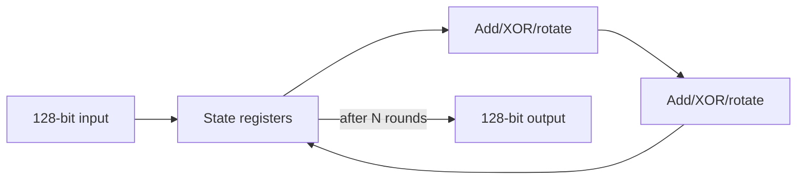

# Architecture

## Historical design boundary

The surviving record identifies the original implementation only as a cryptographic core. The exact cipher/algorithm and RTL structure cannot be recovered safely, so this repository does not invent those details.

## Public reproduction core

`rtl/arx_permutation_core.sv` is a current 128-bit round-iterative ARX permutation surrogate. It exists to restore a nontrivial sequential datapath for synthesis, placement, CTS, routing, timing, congestion, and PPA experiments. One round is executed per cycle; valid/ready handshaking brackets a multi-cycle operation.

### Design decision: iterative rather than fully unrolled

**Problem:** create a compact sequential datapath that still exposes real timing and physical-design tradeoffs.
**Alternatives:** one combinational round, fully unrolled rounds, deeply pipelined unrolled datapath.
**Decision:** one round per cycle with state feedback.
**Tradeoff:** lower area/routing pressure and straightforward timing, at the cost of multi-cycle latency.
**Verification:** Python cycle-independent reference model plus RTL equivalence tests when a simulator is available.

This decision describes the public reconstruction only; it is not retroactively assigned to the lost 16 nm design.
