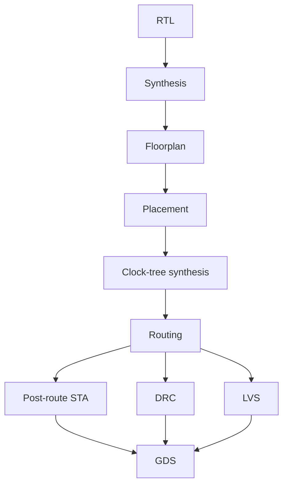

# RTL-to-GDS flow

## Public reproducibility path

The checked-in OpenLane/OpenROAD configuration targets the public ARX surrogate and an open PDK installed by the user. It is intentionally separate from the lost historical 16 nm flow.

Every rerun should record commit, OpenLane/OpenROAD/Yosys versions, PDK identifier/version, clock constraint, floorplan utilization/density, stage runtimes, WNS/TNS, area, power estimate, congestion summary, DRC/LVS status, and generated GDS checksum.

## Historical flow

The surviving record supports physical synthesis/place/route on a 16 nm FinFET cryptographic core, final DRC/LVS resolution, and 228 MHz. It does not preserve exact tools/versions or legally redistributable PDK collateral, so none are guessed.
